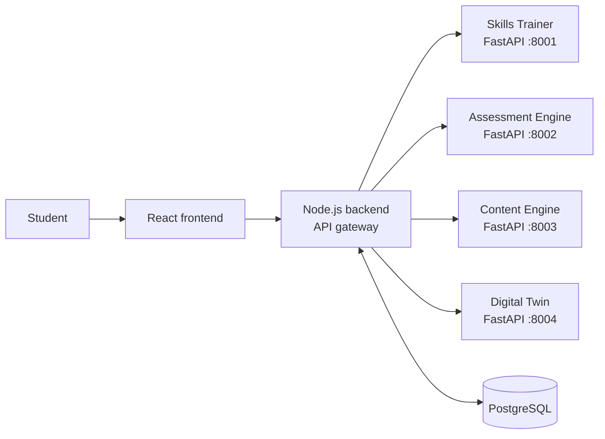

# NeuroLearn AI

An AI-powered e-learning platform for Sri Lankan A/L students studying Chemistry, Physics and Biology in Sinhala.

[](https://github.com/lahirudeshan01/J26-SE-344/actions/workflows/frontend-ci.yml)
[](https://github.com/lahirudeshan01/J26-SE-344/actions/workflows/backend-ci.yml)
[](https://github.com/lahirudeshan01/J26-SE-344/actions/workflows/ai-services-ci.yml)
[](#acknowledgements-and-license)


**Project ID:** J26SE344

## Table of contents

- [About the project](#about-the-project)
- [Key features](#key-features)
- [System architecture](#system-architecture)
- [Tech stack](#tech-stack)
- [Team and component ownership](#team-and-component-ownership)
- [Repository structure](#repository-structure)
- [Getting started](#getting-started)
- [Development workflow](#development-workflow)
- [Development roadmap](#development-roadmap)
- [Evaluation targets](#evaluation-targets)
- [Documentation](#documentation)
- [Research and academic note](#research-and-academic-note)
- [Acknowledgements and license](#acknowledgements-and-license)

## About the project

NeuroLearn AI is a final-year group research project in Software Engineering at the Sri Lanka Institute of Information Technology (SLIIT). It belongs to the Artificial Intelligence and Data Science research cluster.

Sri Lankan A/L students studying in Sinhala need support that reflects both their curriculum and the language in which they learn. NeuroLearn AI brings practical skills training, adaptive assessment, curriculum-aware content, and student insights into one platform.

Platforms such as Labster and PhET mainly check final answers. NeuroLearn AI is designed to track the full procedure, identify error types, and explain feedback in Sinhala. The project follows Design Science Research with Agile iterative prototyping and aligns with SDG 4 (Quality Education), SDG 9 (Industry, Innovation and Infrastructure), and SDG 10 (Reduced Inequalities).

## Key features

The components below describe the planned capabilities; implementation is tracked in the [development roadmap](#development-roadmap).

### AI Virtual Practical Skills Trainer

Models Chemistry and Physics experiments as procedures, then tracks student actions as they work through them. It aims to identify procedural, measurement, safety, and conceptual errors and provide clear Sinhala feedback.

### Adaptive Assessment and Exam Prediction Engine

Adapts assessment to student performance and estimates exam readiness. It is intended to help students and teachers identify topics that need further study.

### Curriculum-Aware Content Generation Engine (RAG)

Retrieves curriculum-aligned material to support generated learning content. Its responses should remain grounded in the collected curriculum materials.

### Student Digital Twin

Maintains a student-focused view of learning progress across the platform. It is intended to support personalized insights using shared student profile and activity data.

## System architecture



A student uses the React frontend, which sends requests to the Node.js API gateway. The gateway directs each request to the relevant Python AI service and uses PostgreSQL for application data. The response returns through the gateway to the frontend.

## Tech stack

| Layer | Technology | Purpose |
| --- | --- | --- |
| Frontend | React, Vite, TypeScript | Student-facing web application |
| Backend | Node.js, Express | API gateway and component routes |
| AI services | Python, FastAPI | Four independently deployable AI components |
| Database | PostgreSQL | Application data storage |
| Development and deployment | Docker, Docker Compose | Build and run the services together |
| Continuous integration | GitHub Actions | Validate frontend, backend, and AI services |

## Team and component ownership

| Name | Student ID | Component | GitHub |
| --- | --- | --- | --- |
| [Gamage L D] (Team Leader) | [IT23224452] | AI Virtual Practical Skills Trainer | [@github] |
| [Ransiluni W A P] | [IT23143654] | Adaptive Assessment and Exam Prediction Engine | [@github] |
| [W W S K Weerasinghe] | [IT23298576] | Curriculum-Aware Content Generation Engine (RAG) | [@github] |
| [P G R D Hettiarachchi] | [IT23297654] | Student Digital Twin | [@github] |

**Supervisors**

| Name | Role |
| --- | --- |
| Hansi De Silva | [Supervisor] |
| Eishan Weerasinghe | [Co-Supervisor] |
| Archchana Sindhujan | [External-Supervisor] |


## Repository structure

```text
.
├── .github/       # CI workflows, pull request template, and code ownership
├── ai-services/   # FastAPI services for the four AI components
├── backend/       # Express API gateway and component modules
├── docs/          # Proposal, architecture, API contracts, and contribution guide
├── frontend/      # React, Vite, and TypeScript application
└── scripts/       # Project scripts
```

Each member owns the matching component area in all three application layers:

| Component | Frontend | Backend | AI service |
| --- | --- | --- | --- |
| Skills Trainer | `frontend/src/features/skills-trainer/` | `backend/src/modules/skills-trainer/` | `ai-services/skills-trainer/` |
| Assessment Engine | `frontend/src/features/assessment-engine/` | `backend/src/modules/assessment-engine/` | `ai-services/assessment-engine/` |
| Content Engine | `frontend/src/features/content-engine/` | `backend/src/modules/content-engine/` | `ai-services/content-engine/` |
| Digital Twin | `frontend/src/features/digital-twin/` | `backend/src/modules/digital-twin/` | `ai-services/digital-twin/` |

Shared code, infrastructure, and documentation are maintained collaboratively. The repository's [CODEOWNERS file](.github/CODEOWNERS) records the current ownership rules.

## Getting started

### Prerequisites

Install the following tools. Confirm the required versions with the project team before setup.

| Tool | Version |
| --- | --- |
| Node.js | [VERSION] |
| Python | [VERSION] |
| Docker and Docker Compose | [VERSION] |
| Git | [VERSION] |

### Clone and configure

```bash
git clone https://github.com/lahirudeshan01/J26-SE-344.git
cd J26-SE-344
cp .env.example .env
```

Edit `.env` with the values for your environment. The example file lists the service ports, AI service URLs, database URL, and JWT secret. Docker Compose uses the default service ports shown below when port values are not set.

### Run with Docker Compose

From the repository root, run:

```bash
docker compose up --build
```

To stop the services, press `Ctrl+C`; run `docker compose down` to remove the containers and network. The PostgreSQL data volume is kept unless you explicitly remove it.

<details>
<summary>Run individual services without Docker</summary>

Open a terminal for each service. Install its dependencies before starting it.

**Frontend**

```bash
cd frontend
npm install
npm run dev
```

**Backend**

```bash
cd backend
npm install
npm run dev
```

The backend reads the root `.env` file. When running services directly, set the AI service URL values to `http://localhost:8001` through `http://localhost:8004` as appropriate.

**Each AI service**

Repeat the following commands from each service directory: `ai-services/skills-trainer`, `ai-services/assessment-engine`, `ai-services/content-engine`, and `ai-services/digital-twin`. Use the corresponding port from the table below.

```bash
python -m pip install -r requirements.txt
python -m uvicorn app.main:app --reload --port <PORT>
```

</details>

### Service URLs and health endpoints

| Service | URL | Health endpoint |
| --- | --- | --- |
| Frontend | `http://localhost:5173` | Not configured |
| Backend | `http://localhost:4000` | `GET /api/health` |
| Skills Trainer | `http://localhost:8001` | `GET /health` |
| Assessment Engine | `http://localhost:8002` | `GET /health` |
| Content Engine | `http://localhost:8003` | `GET /health` |
| Digital Twin | `http://localhost:8004` | `GET /health` |
| PostgreSQL | `localhost:5432` | Not an HTTP service |

### Tests and checks

Run the checks from the corresponding directory:

```bash
# Frontend: lint and production build
cd frontend
npm install
npm run lint
npm run build
```

```bash
# Backend: lint and tests
cd backend
npm install
npm run lint
npm test
```

```bash
# AI services: repeat in each ai-services/<service> directory
python -m pip install -r requirements.txt
python -m pytest
```

The frontend currently has lint and build scripts but no test script. The AI services run their tests separately.

## Development workflow

- **Branches:** Keep `main` as the release branch and `develop` as the integration branch. Create work from `develop` using `feature/<component>-<short-name>`, `fix/<component>-<short-name>`, `docs/<short-name>`, or `chore/<short-name>`. Use `skills-trainer`, `assessment-engine`, `content-engine`, or `digital-twin` as the component name where applicable.
- **Commits:** Use Conventional Commits in the form `<type>(<scope>): <description>`, for example `feat(skills-trainer): add health endpoint`.
- **Pull requests:** Open a pull request for each change, request at least one reviewer, and do not push directly to `main`. Cross-component changes must update the relevant API contract in `docs/api-contracts/`.
- **Code ownership:** Follow the component and shared-code ownership rules in [.github/CODEOWNERS](.github/CODEOWNERS).
- **Contribution guide:** See [docs/CONTRIBUTING.md](docs/CONTRIBUTING.md) for the repository's current branch, commit, and pull request rules.

Each phase below ends with a named milestone and release tag. Release changes are merged from `develop` into `main`.

## Development roadmap

**Schedule anchor:** Week 1 begins [START DATE]. Later weeks are relative to that start.

### A. Overview

| Phase | Focus | Duration | Milestone |
| --- | --- | --- | --- |
| Phase 0 | Repository and project foundation: monorepo, Docker, CI, branch protection, and documentation | Complete | Project foundation — `v0.1` |
| Phase 1 | Foundations | Weeks 1–3 | Shared foundations ready — `v0.2` |
| Phase 2 | Core MVP per component | Weeks 4–8 | Component MVPs ready — `v0.3` |
| Phase 3 | Integration | Weeks 9–11 | Integrated student flow — `v0.4` |
| Phase 4 | Intelligence layer | Weeks 12–14 | Intelligence beta — `v0.5` |
| Phase 5 | Testing and evaluation | Weeks 15–17 | Evaluated release candidate — `v0.6` |
| Phase 6 | Final delivery | Weeks 18–20 | Final delivery — `v1.0` |

### B. Team phase checklists

<details>
<summary>Phase 0 — Repository and project foundation (DONE)</summary>

- [x] Set up the monorepo with frontend, backend, AI services, and documentation folders.
- [x] Add Dockerfiles and Docker Compose configuration for the services.
- [x] Configure CI workflows for frontend, backend, and AI services.
- [x] Set up branch protection and repository code ownership.
- [x] Create the initial project and contribution documentation.
- [x] Tag the foundation milestone as `v0.1` and merge it from `develop` into `main`.

</details>

<details>
<summary>Phase 1 — Foundations (Weeks 1–3)</summary>

- [ ] Define authentication needs and build the shared UI shell.
- [ ] Design the PostgreSQL schema and agree on shared student profile fields.
- [ ] Write API contracts between the backend gateway and all four AI services.
- [ ] Collect and organize curriculum data for each component.
- [ ] Confirm development environments, local service URLs, and team workflow.
- [ ] Review foundation work, complete the shared-foundations milestone, and release `v0.2` from `develop` into `main`.

</details>

<details>
<summary>Phase 2 — Core MVP per component (Weeks 4–8)</summary>

- [ ] Build a first working Skills Trainer flow independently.
- [ ] Build a first working Assessment Engine flow independently.
- [ ] Build a first working Content Engine flow independently.
- [ ] Build a first working Digital Twin flow independently.
- [ ] Add or update service tests and component-level documentation as each MVP takes shape.
- [ ] Review the four component MVPs, complete the component-MVP milestone, and release `v0.3` from `develop` into `main`.

</details>

<details>
<summary>Phase 3 — Integration (Weeks 9–11)</summary>

- [ ] Connect each AI service to its backend gateway routes using the agreed contracts.
- [ ] Connect the frontend to the backend routes for all four components.
- [ ] Implement an end-to-end student flow across the integrated components.
- [ ] Share student profile data across the services through the agreed interfaces.
- [ ] Test component failures, invalid responses, and cross-service behavior.
- [ ] Review integration, complete the integrated-student-flow milestone, and release `v0.4` from `develop` into `main`.

</details>

<details>
<summary>Phase 4 — Intelligence layer (Weeks 12–14)</summary>

- [ ] Prepare collected, curriculum-derived and expert-elicited data for model work.
- [ ] Add and train the planned ML models using available collected data.
- [ ] Tune decision thresholds against component evaluation data.
- [ ] Improve Sinhala feedback and review its clarity with native speakers.
- [ ] Record model and feedback changes in relevant component documentation.
- [ ] Review the intelligence layer, complete the intelligence-beta milestone, and release `v0.5` from `develop` into `main`.

</details>

<details>
<summary>Phase 5 — Testing and evaluation (Weeks 15–17)</summary>

- [ ] Test Skills Trainer error detection and classification against the evaluation targets.
- [ ] Test service and end-to-end performance, including feedback latency.
- [ ] Run usability testing and calculate the System Usability Scale (SUS) score.
- [ ] Fix prioritized defects and retest affected components.
- [ ] Record evaluation methods, results, and limitations for the report.
- [ ] Review the results, complete the evaluated-release-candidate milestone, and release `v0.6` from `develop` into `main`.

</details>

<details>
<summary>Phase 6 — Final delivery (Weeks 18–20)</summary>

- [ ] Complete the project and component documentation.
- [ ] Finish the final report and research references.
- [ ] Prepare and rehearse the project demonstration.
- [ ] Verify the final integrated build and resolve critical defects.
- [ ] Prepare materials for the viva.
- [ ] Complete the final-delivery milestone and release `v1.0` from `develop` into `main`.

</details>

### C. Component-level roadmaps

<details>
<summary>AI Virtual Practical Skills Trainer</summary>

- [ ] **Phase 1:** Define the four error categories: procedural, measurement, safety, and conceptual.
- [ ] **Phase 1:** Select representative Chemistry and Physics experiments with curriculum and expert input.
- [ ] **Phase 1:** Model the selected experiments as procedure graphs or state machines.
- [ ] **Phase 2:** Build a virtual lab UI for the selected experiment flows.
- [ ] **Phase 2:** Implement rule-based deviation detection as the first MVP.
- [ ] **Phase 2:** Identify procedure steps and capture student actions needed for error analysis.
- [ ] **Phase 2:** Classify deviations into the agreed error categories.
- [ ] **Phase 2:** Draft template-based Sinhala feedback for detected errors.
- [ ] **Phase 3:** Validate Sinhala feedback with native speakers and revise unclear templates.
- [ ] **Phase 3:** Connect the trainer to the backend gateway and shared student profile.
- [ ] **Phase 4:** Add an ML classification layer once real session data exists.
- [ ] **Phase 4:** Tune rules and model thresholds using collected session and expert-elicited data.
- [ ] **Phase 5:** Optimize the path to feedback and measure feedback latency.
- [ ] **Phase 5:** Evaluate error detection, classification, latency, and usability against the targets.

</details>

<details>
<summary>Adaptive Assessment and Exam Prediction Engine</summary>

- [ ] **Phase 1:** Define assessment outcomes, supported subjects, and required curriculum data.
- [ ] **Phase 1:** Specify assessment and prediction API contracts.
- [ ] **Phase 2:** Build the first question and response flow.
- [ ] **Phase 2:** Implement an initial performance-based assessment adaptation approach.
- [ ] **Phase 2:** Create an initial exam-readiness estimate and explain its inputs.
- [ ] **Phase 3:** Connect assessment results to the gateway and shared student profile.
- [ ] **Phase 5:** Test result quality and document evaluation limits.

Owner to refine this list: [MEMBER NAME]

</details>

<details>
<summary>Curriculum-Aware Content Generation Engine (RAG)</summary>

- [ ] **Phase 1:** Collect and organize the relevant curriculum-derived source material.
- [ ] **Phase 1:** Define retrieval, grounding, and content response contracts.
- [ ] **Phase 2:** Build document ingestion and retrieval for the selected material.
- [ ] **Phase 2:** Generate a first set of curriculum-grounded learning content.
- [ ] **Phase 2:** Return source context with generated output for review.
- [ ] **Phase 3:** Connect content generation to the gateway and shared student profile.
- [ ] **Phase 5:** Evaluate relevance and curriculum alignment; record known limitations.

Owner to refine this list: [MEMBER NAME]

</details>

<details>
<summary>Student Digital Twin</summary>

- [ ] **Phase 1:** Agree on the shared student profile fields and data ownership.
- [ ] **Phase 1:** Define the profile and learning-insight API contracts.
- [ ] **Phase 2:** Build the first student profile data model and service endpoints.
- [ ] **Phase 2:** Aggregate available assessment and component activity data.
- [ ] **Phase 2:** Present an initial view of student progress and learning insights.
- [ ] **Phase 3:** Connect the Digital Twin to the gateway and integrated student flow.
- [ ] **Phase 5:** Test profile consistency and document data gaps and limitations.

Owner to refine this list: [MEMBER NAME]

</details>

### Definition of Done

- [ ] Code has been reviewed.
- [ ] Relevant tests pass.
- [ ] The API contract is updated when the task changes an interface.
- [ ] Related documentation is updated.
- [ ] CI is green.

### Risks and mitigation

| Risk | Mitigation |
| --- | --- |
| Limited real student data | Start with curriculum-derived and expert-elicited material; add ML classification only when real session data exists. |
| Sinhala language quality | Use template-based feedback first and validate wording with native speakers. |
| Delays integrating components | Agree on API contracts early, integrate through the gateway, and test the student flow incrementally. |
| Team workload across components | Keep component ownership clear, track work by phase, and coordinate shared changes through review. |
| Model accuracy below target | Measure against the targets, tune rules and thresholds, and document remaining limitations. |

## Evaluation targets

These are targets for the **AI Virtual Practical Skills Trainer**, not reported results.

| Measure | Target |
| --- | --- |
| Error detection accuracy | >=85% |
| Error classification accuracy vs. expert judgement | >=80% |
| Feedback latency | <2s |
| System Usability Scale (SUS) | >=68 |

## Documentation

- [Project proposal](docs/proposal/)
- [Architecture](docs/architecture/)
- [API contracts](docs/api-contracts/)
- [Contribution guide](docs/CONTRIBUTING.md)

## Research and academic note

Use IEEE referencing in project research and academic documentation. Learning data should be curriculum-derived and expert-elicited, not synthetic.

NeuroLearn AI is an academic project developed as a final-year group research project at SLIIT.

## Acknowledgements and license

The team acknowledges the guidance of supervisors Archchana Sindhujan, Eishan Weerasinghe, and Hansi De Silva.

**License:** [LICENSE]

### Placeholders to complete

- `[MEMBER 1 FULL NAME]` (once), `[MEMBER 2 FULL NAME]` (once), `[MEMBER 3 FULL NAME]` (once), and `[MEMBER 4 FULL NAME]` (once)
- `[ID]` (4 occurrences)
- `[@github]` (4 occurrences)
- `[ROLE]` (3 occurrences)
- `[VERSION]` (4 occurrences)
- `[START DATE]` (once)
- `[MEMBER NAME]` (3 occurrences)
- `[LICENSE]` (twice: badge and license field)
